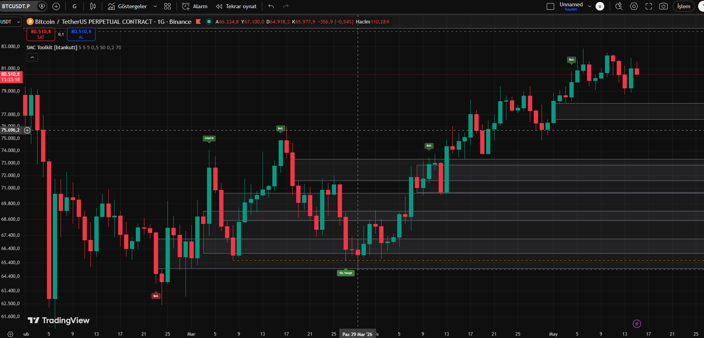
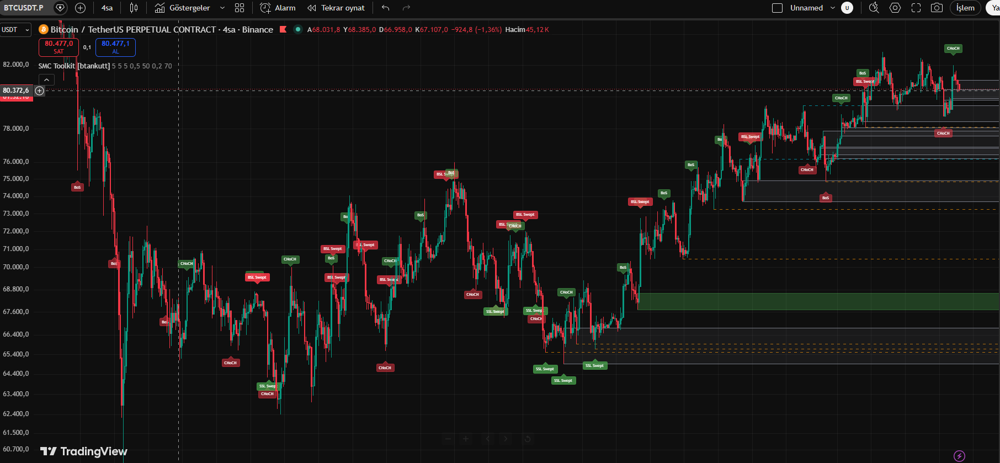

# SMC Toolkit

> TradingView için Akıllı Para Konseptleri (SMC) göstergesi — Order Blocks, Fair Value Gaps (FVG), Likidite Sweep'leri ve Piyasa Yapısı (BoS/CHoCH) tek bir Pine Script v6 dosyasında.

🇬🇧 [English README](README.md)

---

## Genel Bakış

Akıllı para fiyat-aksiyonu trader'larının kullandığı standart, kamu-malı (public-domain) konseptleri uygulayan bağımsız bir SMC göstergesi:

- **Piyasa Yapısı** tespiti (Yapı Kırılımı ve Karakter Değişimi)
- **Order Blocks** — yapısal kırılımlarda tespit edilir, isteğe bağlı hacim filtresiyle
- **Fair Value Gaps** — ATR-ölçekli minimum boyut filtresiyle
- **Likidite** seviyeleri (eşit highs/lows) ve sweep tespiti

Her bileşen bağımsız çalışır — input'lar ile özellikleri açıp kapatabilirsiniz. Mitige edilmiş Order Block'lar ve dolan FVG'ler otomatik olarak gri'ye boyanır, grafik temiz kalır.

Bu gösterge [SMC Pine Suite](../../README.tr.md)'in parçasıdır. Pine Script v6 özellikleriyle inşa edildi: user-defined types, metodlar (dot notation) ve zoom-stable çizimler için time-based xloc.

---

## Özellikler

### 1. Piyasa Yapısı (BoS / CHoCH)

Yapılandırılabilir pivot uzunluğu ile swing highs ve lows'u takip eder. Fiyat en son swing'i kapanışla aşınca:

- **BoS (Yapı Kırılımı)** — fiyat mevcut trend yönünde devam eder
- **CHoCH (Karakter Değişimi)** — fiyat trende karşı kırar, olası dönüş sinyali

Kırılım noktalarında yön bilgili etiketler belirir (yeşil/kırmızı).

### 2. Order Blocks

BoS oluştuğunda gösterge geriye doğru tarar ve son ters renkli mumu bulur — bu Order Block olur. İsteğe bağlı hacim filtresi düşük hacimli mumları dışlar (20-periyot hacim SMA'sına karşı karşılaştırılır).

- Bullish OB'ler (yukarı kırılım öncesi oluşan) yeşil çizilir
- Bearish OB'ler (aşağı kırılım öncesi oluşan) kırmızı çizilir
- Maksimum gösterim sayısı yapılandırılabilir (varsayılan: yön başına 5)
- Fiyat tarafından dokunulan OB'ler mitige edilmiş olarak işaretlenir ve gri'ye boyanır

### 3. Fair Value Gaps

3-mum gap desenlerini tespit eder:

- **Bullish FVG** — mevcut low, iki bar geride high'tan yüksek
- **Bearish FVG** — mevcut high, iki bar geride low'dan düşük

Minimum boyut (ATR çarpanı) ile filtrelenir, gürültü-seviyesi gap'ler atlanır. Dolan FVG'ler (fiyat gap içine dönen) işaretlenir ve renkleri değiştirilir.

### 4. Likidite Seviyeleri

ATR-ölçekli tolerans içinde eşit-highs ve eşit-lows takip eder, likidite havuzları oluşturur:

- **Alış-tarafı likidite (BSL)** — fiyatın üstündeki eşit highs (short stop'lar buraya kümelenir)
- **Satış-tarafı likidite (SSL)** — fiyatın altındaki eşit lows (long stop'lar buraya kümelenir)

Sweep, fiyat bir seviyenin ötesine wick atıp tekrar içeride kapatınca gerçekleşir. Sweep etiketleri olayı işaretler.

### 5. Altı Alarm Koşulu

Her büyük olay ayrı bir alarm tetikler:

- BoS Bullish / BoS Bearish
- CHoCH Bullish / CHoCH Bearish
- BSL Swept / SSL Swept

Göstergeyi grafiğe ekledikten sonra TradingView'in "Alarm Oluştur" dialog'undan alarmları yapılandırın.

---

## Kurulum

1. TradingView'i açın ve herhangi bir grafiğe gidin
2. **Pine Editor**'ü açın (alttaki panel)
3. [`smc-toolkit.pine`](smc-toolkit.pine) içeriğini kopyalayın
4. Pine Editor'a yapıştırın ve **"Save"**'e tıklayın (bir ad verin)
5. **"Add to chart"**'a tıklayın

Gösterge anında derlenip grafiğinize overlay olur.

---

## Yapılandırma

Tüm input'lar gösterge ayarları dialog'unda gruplandırılmıştır:

### Yapı
- `Swing detection length` (varsayılan: 5) — Pivot sol/sağ uzunluğu. Düşük değerler = daha hassas ama daha gürültülü.
- `Show internal structure` (varsayılan: false) — Gelecek kullanım için rezerve
- `Show external structure` (varsayılan: true) — BoS/CHoCH etiketlerini aç/kapat

### Order Blocks
- `Enable Order Blocks` (varsayılan: true)
- `Max OBs to display` (varsayılan: 5) — Limit aşılınca eski OB'ler otomatik silinir
- `Filter by volume` (varsayılan: true) — Sadece ortalama-üzeri hacimli OB'ler tutulur
- `Bullish/Bearish OB color` — Renk ve şeffaflığı özelleştirin

### Fair Value Gaps
- `Enable FVG` (varsayılan: true)
- `Max FVGs to display` (varsayılan: 5)
- `Min FVG size (ATR multiplier)` (varsayılan: 0.5) — Daha fazla FVG görmek için düşürün, gürültüyü filtrelemek için yükseltin
- `Bullish/Bearish FVG color` — Özelleştirin

### Likidite
- `Enable Liquidity` (varsayılan: true)
- `Equal highs/lows lookback` (varsayılan: 50) — Taranacak geçmiş bar sayısı (geriye-bakış)
- `Tolerance (ATR multiplier)` (varsayılan: 0.2) — Eşit sayılması için highs/lows ne kadar yakın olmalı (tolerans)

### Görüntü
- `Show event labels` (varsayılan: true) — BoS, CHoCH, sweep etiketlerini aç/kapat
- `Box transparency` (varsayılan: 70) — Kutu dolgu şeffaflığı

---

## Ekran Görüntüleri

### BoS / CHoCH Tespiti

Gösterge yapısal kırılımları net yön bilgili etiketlerle işaretler.

### Order Block + Likidite

Order Block'lar yapısal kırılım noktalarında belirir, likidite seviyeleri eşit-high havuzlarını gösterir.

---

## Pine Script v6 İmplementasyon Notları

Bu gösterge Pine Script v6'nın birkaç özelliğini kullanır — bunlar v5'e göre iyileştirmedir:

- **User-defined types** — `OrderBlock`, `FVG`, `LiquidityLevel` struct'ları mantıksal durumu organize tutar
- **Method syntax (dot notation)** — `arr.push()`, `box.delete()`, `ref.set_bgcolor()` daha temiz kod için
- **Time-based xloc** — Zoom yapıldığında çizimler sabit kalır (`xloc.bar_time` kullanır, bar index yerine)
- **Strict boolean typing** — `trend_initialized` flag deseni Pine v6'nın "bool-na-olamaz" kuralını aşar
- **Magic number'lar sabitlere taşındı** — Tüm threshold'lar adlandırılmış: `ATR_LENGTH`, `VOLUME_SMA_LENGTH`, `OB_LOOKBACK_BARS`, `PIVOT_BUFFER_SIZE`

Pine v5'ten geçiş yapıyorsanız, [TradingView'in resmi geçiş kılavuzuna](https://www.tradingview.com/pine-script-docs/migration-guides/to-pine-version-6/) bakın.

---

## Nasıl Kullanılır

### Konservatif trading kurulumu

1. Yüksek zaman diliminde (örn. 4H veya günlük) **CHoCH**'u bekleyin
2. Düşük zaman dilimine geçin (örn. 15M veya 1H)
3. Fiyatın **mitige edilmemiş Order Block**'a veya **dolmamış FVG**'ye geri çekilmesini bekleyin
4. Yapısal destek/dirençte **likidite sweep**'i konfluans için arayın
5. Stop-loss'u OB/FVG'nin ötesine, hedefi bir sonraki likidite havuzuna koyarak giriş yapın

### Agresif kurulum

1. **BoS**'tan sonra (devam sinyali), ilk geri çekilmede giriş yapın
2. En son OB'yi geçersizleştirme seviyesi olarak kullanın
3. R:R oranına göre risk yönetimi yapın

> ⚠️ Bu bir eğitim aracıdır. Stratejinizi her zaman geri-test edin ve uygun pozisyon büyüklüğü kullanın.

---

## Pivot Onay Gecikmesi

Gösterge `ta.pivothigh(swing_length, swing_length)` kullanır — bu, pivot'u onaylamak için `swing_length` bar gerektirir. Bu şu anlama gelir:

- Yapısal kırılımlar oluştuktan `swing_length` bar **sonra** tespit edilir
- Bu lookahead bias'ı önler ama küçük bir gecikme getirir
- `swing_length`'i tepkisellik vs güvenilirlik dengesi için ayarlayın

Varsayılan `swing_length = 5` 1H ve üzeri zaman dilimlerinde iyi çalışır. 15M veya altı için 3'e düşürmeyi düşünün.

---

## Performans

- **Derleme süresi:** Çoğu grafikte ~1-2 saniye
- **Bellek:** `max_boxes_count=500`, `max_lines_count=500`, `max_labels_count=500` ile sınırlı
- **Repaint:** Yok. Pivot-tabanlı tespit onay bekler, çizimler zaman-tabanlı koordinatlar kullanır.

---

## Lisans

Bu gösterge **Mozilla Public License 2.0** (MPL 2.0) altında açık kaynaktır. Tam metin için [LICENSE-FREE](../../LICENSE-FREE) — bkz.

Bu kodu kendi stratejileriniz için kullanabilir, değiştirebilir, fork'layabilir ve uyarlayabilirsiniz. Değişiklikleri yeniden dağıtırsanız, MPL 2.0'a göre atıf ve aynı-lisans şartları geçerlidir.

---

## Sorumluluk Reddi

Bu gösterge **olduğu gibi** sağlanır, kârlılık veya doğruluk garantisi olmadan. Akıllı Para Konseptleri yorumlamaya açıktır — farklı trader'lar farklı uygular. Her zaman:

- Stratejinizi geçmiş veriler üzerinde kapsamlı şekilde geri-test edin
- Canlı işlem öncesi demo hesapta ileri-test yapın
- Hesabınıza uygun pozisyon büyüklüğü ve stop-loss'lar kullanın
- Hiçbir göstergenin trader muhakemesi ihtiyacını ortadan kaldırmadığını unutmayın

İşlem yapmak risk içerir. Geçmiş performans gelecekteki sonuçları garanti etmez.

---

## Yazar

**Barış Tankut** ([@btankutt](https://github.com/btankutt))
Algoritmik Ticaret Sistemleri & IoT Gömülü Mühendis

[SMC Pine Suite](../../README.tr.md)'in parçası — üretim sınıfı Pine Script v6 göstergeleri.
